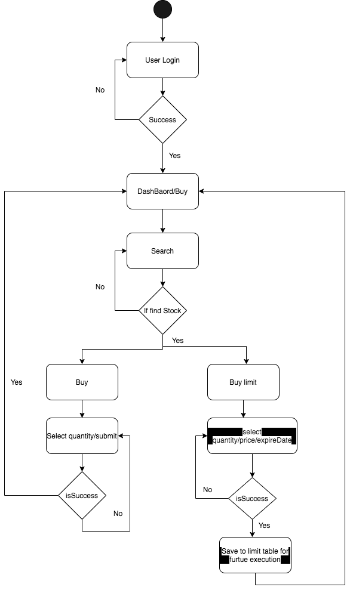

# StockSystem

<h2>Overview</h2> 
This stock trading application provides users to trade(buy/sell) the stock online and keep tracking of their transactions. 

<h2>Techs</h2>
FrontEnd : React, node.js
 
BackEnd : Spring boot, Spring mvc, Spring JPA
 
DB : Embedded H2

<h2>Activity Diagrams</h2>

.....
<h2>Class Diagram</h2>

<h2>How to start application ?</h2>

